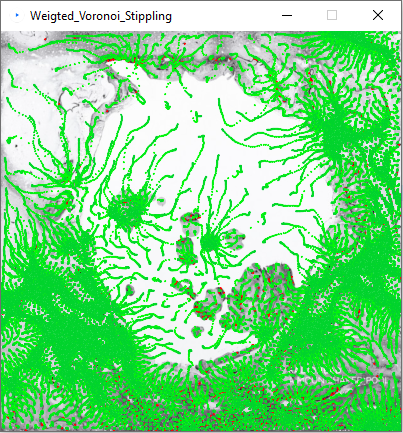

This project contains a processing sketch for creating a stippling version of an input image by applying [Weighted Voronoi Stippling](https://www.cs.ubc.ca/labs/imager/tr/2002/secord2002b/secord.2002b.pdf). An example: 

   

# Usage
To be added :)

# Parameters
Parameters for image:
* `input_name`: relative path to your image 
* `canvas_w`: width of your image
* `canvas_h`: height of your image

Paramters for stippling
* `N`: number of seed points
* `thresh`: treshold to place initial seed points -> lower thresh means initial points will be more clustered in the darkest areas
* `max_iter`: maximum number of relaxation iterations

Parameters for debugging:
* `show_paths`: flag for showing paths the seed points make in their relaxation
* `show_diagrams`: flag for showing the voronoi diagrams used to relax the seed points
* `preview_only`: flag for preventing relaxation, only shows the initial seed points
* `print_logs`: flag for printing messages at each function call
* `show_imgs`: flag for showing the input image under the stippling

Parameters for plotting:
* `save_hpgl`: flag for generating and saving the relaxed stipples
* `output_name`: relative path to the output file (will create a new file if file is not found, or overwrite an existing file)
* `scale_offset`: the offset to the scaling: the short side of the paper will be max(canvas_w, canvas_h) + offset
* `plot_w`: currently unused -- might be used for plotter coordinates
* `plot_h`: currently unused -- might be used for plotter coordinates
* `plot_offset_x`: currently unused -- might be used for offsetting the output relative to a different starting point
* `plot_offset_y`: currently unused -- might be used for offsetting the output relative to a different starting point

# Notes
No notes at this very moment :)

Find out more at [this wiki page](https://pzwiki.wdka.nl/mw-mediadesign/index.php?title=User:Thijshijsijsjss/Pen_Plotting_Panache/Plotillism&action=edit)
